Welcome To Organic Cat -

Organic Cat is my Fifth Portfolio Project for my Level 5 Diploma in Web Application Development with the Code Institute.
I particularly liked this project because my partner and my daughter whom both have multiple's of cats helped me find products 
and gave me inspiration. 

It is a Full Stack, multi-application, E-Commerce site with the ability to
take Stripe Payments. This site also delivers a powerful administration for the site owner or business administration.
I hope you enjoy.


The live link can be found here: [Live Site](https://organiccat.herokuapp.com/)

## Table of Contents
* [User Experience Design (UX)](#User-Experience-Design)
    * [The Strategy Plane](#The-Strategy-Plane)
        * [Site Goals](#Site-Goals)
        * [Market Analysis](#Market-Analysis)   
        * [Seo Implementation](#SEO-IMPLEMENTATION) 
        * [Agile Planning](#Agile-Planning)
          * [Epics and user stories](#epics-and-user-stories)
    * [The Scope Plane](#The-Scope-Plane)
    * [The Structure Plane](#The-Structure-Plane)
      * [Features](#Features)
      * [Future Features](#Features-Left-to-Implement)
    * [The Skeleton Plane](#The-Skeleton-Plane)
        * [Wireframes](#Wireframes)
        * [Database Design](#Database-Design)
        * [Security](#Security)
    * [The Surface Plane](#The-Surface-Plane)
        * [Design](#Design)
            * [Colour Scheme](#Colour-Scheme)
            * [Typography](#Typography)
            * [Imagery](#Imagery)
* [Technologies](#Technologies)
* [Testing](#Testing)
* [Deployment](#Deployment)
    * [Version Control](#Version-Control)
    * [Heroku Deployment](#Heroku-Deployment) 
* [Credits](#Credits)
  * [Content](#Content)
  * [Acknowledgements](#Acknowledgements)
  * [Must Haves](#Version-Control)

# User-Experience-Design

## The-Strategy-Plane

### Site-Goals
* Organic Cat is a Busines to Consumer- B-2C, E-Commerce website.

- The sites primary audience will be people who love cats and are interested in organic treats and natural materials.
- Old, young, and everyone who owns a cat. 
- Market Analysis shows massive growth in this area and further that Organic and Sustainable product demands are on the rise. 

* Deploy a Full Stack E-Commerce website, including STRIPE payments, additionally with back-end administration.  

## Market analysis
* "Cats are the second-largest consumers of pet food in the world."
* "The Cat Food Market is growing at a CAGR of 5.3% over the next 5 years."
* "CAGR - CAGR stands for the Compound Annual Growth Rate. It is the measure of an investment’s annual growth rate over time, with the effect of compounding taken into account. It is often used to measure and compare the past performance of investments or to project their expected future returns. The CAGR formula is equal to (Ending Value/Beginning Value) ^ (1/No. of Periods) – 1.
* "Middle East and Africa is growing at the highest CAGR over 2018 - 2028."
* "Europe holds the highest share in 2021." mordorintelligence.com

* Europe continues to dominate the global cat food market. The popularity of cats continued to increase during the last century in the region, according to various studies. The number of cat owners increased more than dog owners due to the relative ease of having a cat as a pet in the modern lifestyle. Dry, wet, and semi-moist food are the major types of commercial cat food.

* "Germany, the largest economy in the European Union, is a big and promising cat food market. The German industry is mature munchableat saturated, although it is steadily growing. German cat owners are trending toward products that ‘humanize’ the care of their cats, and in response, manufacturers have developed premium cat foods focusing on health and wellness. The trends in the cat food sector often correspond to those in human nutrition. Companies are offering an increasing number of premium products as consumers are prepared to spend more on pet food that is healthy, nutritious, and improves their living conditions. For instance, in 2020, the German pet treat company Gimborn launched a line of functional pet treats. The products include squeezables, oil-based liquid treats, and munchables and crunchy treats for cats. The consumer trend toward cat adoption has driven cat food premiumization, which is anticipated to create an expansion of the cat food market over the forecast period."
According to the lates research.Cat accessories is set to witness high growth during the time period 2023-2031.

* "Additionally, pet ownership and purchasing behavior have remained unchanged from May to June 2020. As per the APPA report, there was no significant change in pet owners being financially cautious about their pet product spending, with a majority (64.0%) spending the same amount from May to June."

* "Government agencies, pet food manufacturers, retailers, and veterinarians play crucial roles in ensuring the safety of cat food and safeguarding pets and their owners. Recent legislation is expected to increase the government’s role in regulating cat food and may affect many manufacturers"

* [Site: Mordor Report](https://www.mordorintelligence.com/industry-reports/global-cat-food-market-industry) 
 
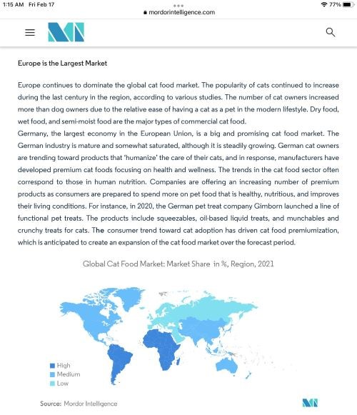


### SEO IMPLEMENTATION

* Choose a business idea to do your keyword research for.

* Natural Cat Products, cats, organic food, cat food, kats, kittens, healthy, pets, accessories, pet care, 

* "Keyword research is not an exact science. The volume and popularity of keywords constantly shifts. This means that deciding on keywords for a project is just the beginning of a journey, and marketing departments for e-commerce businesses have to continuously analyse and adjust them." CI 

* rel="noopener" in an <a>a</a> tag for social icons -check

* use the <strong> strong </strong> attribute, both visual and seo's see these tags. -some -check

* Metadata is always in the head and the most valuable to search engines. Anna Greives "Keyword stuff to the maximum" 

* Add descrptive alt_tags. I added it to my product model

* Facebook [facebook](https://www.facebook.com/profile.php?id=100090668165486)


### Agile Planning

This project was developed using agile methodologies by delivering small features in incremental sprints. There were 4 sprints in total, spaced out evenly over 4 weeks.

All projects were assigned to epics and user stories, prioritized under the labels. User Stories were assigned to Epics and Epics were assigned to sprints. It was done this way to ensure that all core requirements were completed first to maintain completion. More aesthetic User Stories were added near last sprint. 

(This is a personal decision as per how my mind and anxieties work. Tech before aesthetics and MVC.)

Initial Design comes parrarelel with tech and more aesthetic design continues until completion.


The Kanban board was created using github projects and can be located [here] and can be viewed to see more information on the project cards. 

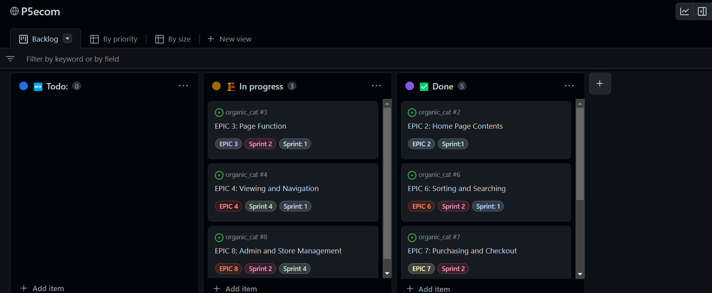


#### Epics and User Stories
The following user stories (by epic) were completed over the 4 sprints:
The project had 9 main Epics (milestones):

**EPIC: 1 Developer Set-UP User Stories**

As a developer, I need to create the base.html page and structure so that other pages can reuse the layout

As a developer, I need to create static resources so that images, css and javascript work on the website

As a developer, I need to create the django apps that allow me work on the website

As a developer, I need to set up the project so that it is ready for implementing the core features

As a developer, I need to create the Home Page with conetent.

**EPIC 2: Home Page Contents**

As a developer, I need to create the navbar so that users can navigate the website from any device

As a developer, I need to create the logo so that users can navigate the website from any device

As a developer, I need to create the footer with social media links and contact information

As a Developer, I want to add Homepage Image Slider so that clients have more calss to action

As a Developer, I want to add Categories so that it helps the shopper find their products faster

As a developer, I want to add Products so that we can fullfill an ecommerce website

As a Developer, I want to add Accessories for more options for the user

As a Developer, I want to add Special Offers to offer inexpensive goods
 
As a Developer, I want to add Reviews to that products can be reviewed 

As a Developer, I want to add Like/Heart Button to add favor for poplular items 

As a Site User, I would like to be able to view all Products, Accessories, and Special offers to help me make good shopping decisions

**EPIC 3: Page Function**

As a Developer, I wan to create a Products Page that contains all the products for my ecommerce website

As a Developer, I wan to create a Products Detail Page that gives the user to find out more information.

As a Developer, I want to add Categories so that the user can make their search for desired products fast and effective. 

As a Developer, I need to implement a 404 error page to alert users when they have accessed a page that doesn't exist

As a Customer, I want to be able to search the ecommerce page.

As an Admin user, I want to be able to login and logout.

As a Developer, I need to implement a 404 error page to alert users when they have accessed a page that doesn't exist

Aa a Site Admin, I can update products in the admin backend.

As a Site Admin I can approve edit and delete staff members.

**EPIC 4: Viewing and Navigation**

As a developer I must revisit, refactor, fix bugs""

As a Shopper I can view a home page so that lovely introduction too site

As a Shopper I can view a list of buttons so that select something to purchase

As a Shopper I can view a cart icon so that I can see how much cost I accumulate

As a Shopper I can view a list of products so that select something to purchase

As a Shopper I can view a specific category of products so that quickly find products I am interested in

As a Shopper I can view items that are on sale and clearances so that save money on purchases

As a Shopper I can view a total of my purchases so that avoid spending too much


**EPIC 5: Registration and User Accounts**

As a developer I must develop registration account function that allows users to make a profile so that fulfil

As a developer I must develop the ability to log in and logout with django allauth so that security tokens are used

As a developer I must develop **the ability for users to recover their password **so that everyone feels secure and site maintains secure

As a developer I must develop user profile so that the user can log in and out

As a Site User I can Easily Register for an account so that I have a personal account to be able to view my profile

As a Site User I can Easily Log In and Log Out so that Access my personal account

As a Site User I can Easily Recover my password ** so that Recover access to my account

As a Site User I can Have a personalized user profile so that View my personal order history and payment information 

**EPIC 6: Sorting and Searching**

As a Developer, I want to add Navigation so that the user can make their search for desired products fast and effective.

As a Shopper, I want to be able to search the ecommerce page.

As a Developer, I want to add Categories so that the user can make their search for desired products fast and effective.

As a Shopper, I want to be able to search the ecommerce page.

As a Shopper I can sort the list of available products so that Easily identify best price, categories and sorted products

As a Shopper I can sort a specific category so that Easily identify best price, best rated, and sort by categories

As a Shopper I can search by product name, description, so that Find a specific product to purchase

As a Shopper I can Easily search for what I have searched for and the number of results so that I can quickly find the availability of the product

**EPIC 7: Purchasing and Checkout**

As a Developer I can add a cart app so that **the shopper can add items to the cart **

As a Developer I can a checkout app so that the shopper can view bag items and make a purchase

As a Developer I can add an edit cart functions so that shopper can edit cart contents

As a Developer I can add a payment method so that shoppers can purchase through my website

As a Shopper I can add items to the cart so that they will be organized in one place

As a Shopper I can view items in cart through the checkout so that they can edit and make a purchase

As a Shopper I can edit items in the cart through the checkout so that the shopper can add or subtract items in the cart

As a Shopper I can make safe purchases so that supply payment information and return to the store for more purchase in the future

**EPIC 8: Admin and Store Management**

As a developer I can add a product function to give to the store owner so that the store has new products

As a developer I can add edit and update functions so a product functionality so that when prices, descriptions, and images change I can also change them

As a developer I can add delete functions so that Items can be removed when not in stock or no longer work

As a store owner I can add a product ** so that my store has new products

As a store owner I can edit and update a product ** so that when prices, descriptions and images change I can also change them

As a store owner I can delete **** so that Items can be removed when not in stock or no longer work

**EPIC 9: Read Me and Testing file**

As a developer I must document everything so that I can continue to develop my skills

As a developer I must test every function so that I can work out bugs and 

* Complete readme documentation


## The-Scope-Plane

* Fully Functioning E-Commerce Application - Guests and Commerce

* Backend administration controls. For Admin

* Responsive Design - Site should be fully functional on all devices from 320px up for Mobile device usage

* User Profiles - Make Purchases, reviews, contact form, mail chimp, Sign Up for accounts, password recovery, purchase, adjust order,   

* Users Admin - Icons for Accounts Both user and Product managers camn access, update, edit and delete products

* User Guests - Make Purchases, contact form, mail chimp.

* Hamburger menu for mobile devices and a reduced screen size

* Ability to perform CRUD functionality for Members 

* Restricted role based features


## The-Structure-Plane

### Features

Implementation:

**Navigation Menu**

 The Navigation contains drop-down menus

The following navigation items are available.

  * Home -> index.html - View home 
  
  * All Products -> Price, Rating, Category, All Products
  
  * Food -> Dry Food, Wet Food, Snacks, All Food
  
  * Accessories -> collars,brushes, trees, bowls, beds, toys
  
  * Offers -> New Arrivals, Deals, Clearance, All Specials
 
  * My Account -> logout.html - Visible to logged in users
  
  * Cart -> 

**Base Setup User Stories**

The following stories were implemented in order to set up a base structure for all the HTML pages and the core installations and configurations needed to run the application. While these do not show as individual features, they were stories completed that were needed to implement all of the stories above.

As I am a student I will most likely revisit some of these ideas as making migrations or adjusting to design and learning curve. 

``As a developer, I need to create the base.html page and structure so that other pages can reuse the layout``

``As a developer, I need to create static resources so that images, css and javascript work on the website``

``As a developer, I need to set up the project so that it is ready for implementing the core features``
  
Implementation: ``As a developer, I need to create the Home Page with content.``


**Home Page**

The home page contains 3 slider images of the whole idea of the store. Cat accessories, cats with toys, organically grown catnip with a bee, with captions\calls to action. The Navigation bar is super open, elegant, and fixed to the top while you scroll.
 
This will immediately make it evident to the user, what the purpose of the website is. Products for your feline friends. 

The navigation menu is displayed on all pages and drops down into a hamburger menu on smaller devices. 
This will allow users to view the site from any device and not take up too much space on mobile devices.

* Navigation  Bar: ``As a developer, I need to create the navbar so that users can navigate the website from any device``

[Navbar](docs/readme_images/navbar.png)

[Dropdown Menu Example](docs/readme_images/products-dropdown.png)

implementation: ``As a developer, I need to create the logo so that users can navigate the website from any device``

* Logo


implementation: ``As a Developer, I want to add Homepage Image Slider so that clients have more calss to action``

* Slider Image plus CTA.

| Slider Images Plus Call To Action |[Slider Image](docs/readme_images/slider-image.png)

* Account and Cart Icons: ``As an Developer I can add a accounts app and Icon so that the shopper can add items to the cart ``

| Acount Cart Icons|[Account and Cart Icons](docs/readme_images/icons.png)


* Free Delivery Threshold banner

[Free Delivery Threshold Banner](docs/readme_images/fdt.png)

Implementation: ``As a developer, I need to create a footer so that i can have instructions for shoppers ``

**Footer** 

``A footer has been added to the bottom of the site, this contains a Twitter and Facebook link so that users can find us on social media'``


implementation:``As a user, I want to be able to login and logout.``

* Sign in Page 


implementation:``As a user, I want to be able to login and logout.``

**Signed OUT**


implementation: ``As a Developer, I wan to create a Products Page that contains all the products for my ecommerce website``

**View Product Page**

A Product Page. 


implementation: ``As a Developer, I wan to create a Products Detail Page that gives the user to find out more information.``

**View Product Detail Page**

A Product Detail Page. 

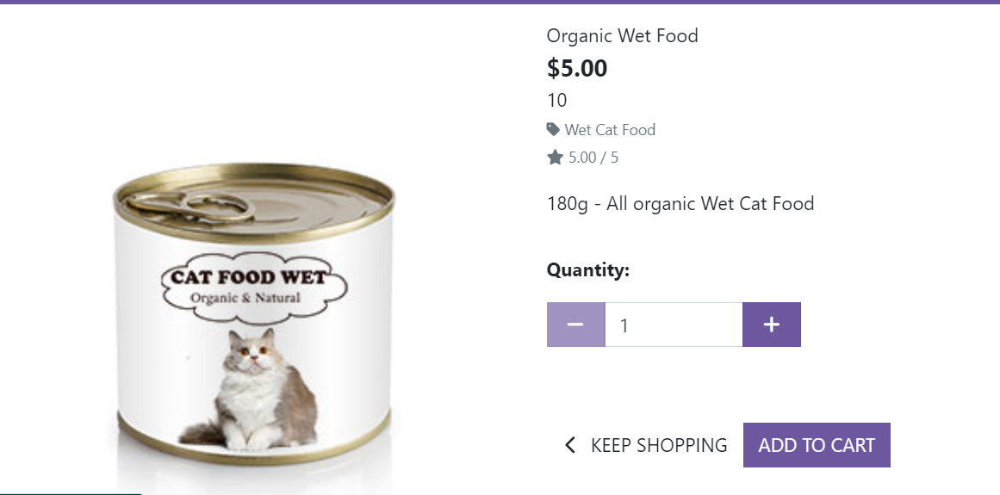

Implementation:

**Register Page**

```As a Developer, I wan to develop customer profile was implemented to allow staff users to view orders via the UI without having to use the backend admin panel.``


implementation: ```As a Developer, I wan to develop customer Reviews was implemented to allow users to make reviews and CRUD functions.``

**Reviews Section**


implementation:``As a Shopper I can view a total of my purchases so that avoid spending too much``

**Grand Total**


implementation:

**Checkout**


implemetation: ``As a developer I can add a product function to give to the store owner so that the store has new products``

``As a developer I can add a product function to give to the store owner so that the store has new products``

``As a developer I can add edit and update functions so a product functionality so that when prices, descriptions, and images change I can also change them``

``As a developer I can add delete functions so that Items can be removed when not in stock or no longer work``

``As a store owner I can add a product so that my store has new products``

``As a store owner I can edit and update a product ** so that when prices, descriptions and images change I can also change them``

``As a store owner I can delete so that Items can be removed when not in stock or no longer work``

**Product Management**

* Edit Button and Delete Button


**Profile Page Form**


* Delete a Product Success toast was created instead


* Delete a Product Success


Implementation:

**Alert Message**

Generic Alert messages were used to inform members of their actions

* Add Product Message -successful test of message


* Inventory Error Message -successful test 


* Remove Product Success From Cart -successful test


* Payment Success - successful test


* Editing a product warning

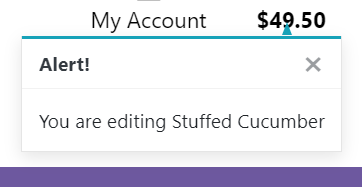


Implementation:

**Error Pages**

Implementation:

**404 Message**


**500 Message** 


The 404 message will allow the user to easily understand what is occuring.
This covers: The occurances happen in the pages below. It is implemented into the code with a
using a basic django message. 

* Bad Url 
* Product Details - get_object_or404
* Reviews - get_object_or_404

Implementation:

**Favicon**

  * A site wide favicon was implemented.
  * This provides an image in the tabs header to allow the user to easily identify the website if they have multiple tabs open.


### Features Left To Implement

## The-Skeleton-Plane

### Wireframes Computer and Mobile

Wire frames were also created as a rough sketch to represent obejects within the site.

This is the home page.

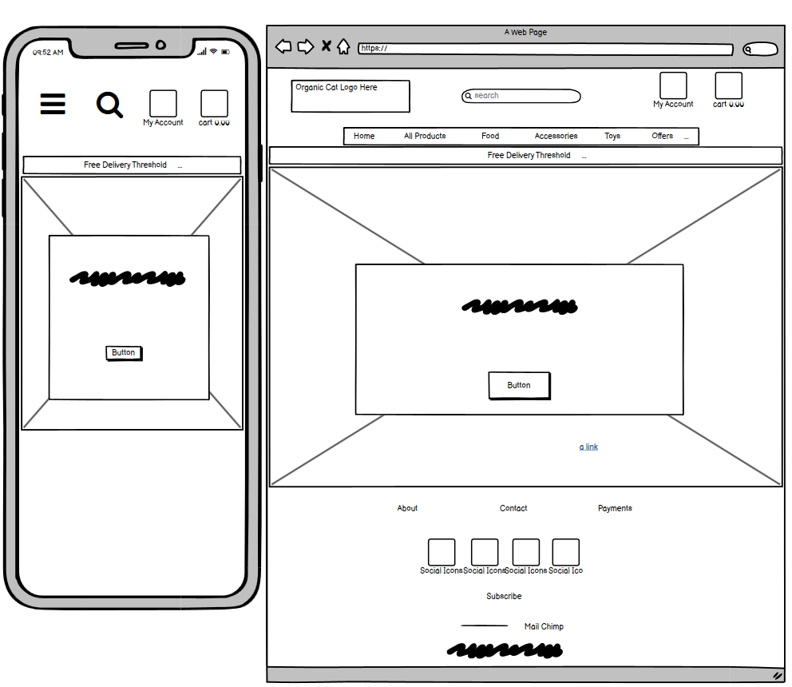

This is the Product page.


This is a wire frame Product Detail Page


This is a wire frame Checkout


This is a wire frame Checkout Success 


Profile Page- Gives the user CRUD Functions for delivery 


Implementation:
### Database-Design

* Data Design as an E-Commerce. Product Data Base that allows the administration full CRUD and to those Product Managers CRUD functions for the front end in the nav bar.

* Users also have CRUD functions for their Profile to change their Profile delivery Information and to view their pruchase history.

* Reviews also gives users the ability for CRUD functions and they are aloud while logged in to Create, Read, Update or Delete their reviews.

* Entity relationship diagram was created using [DBVisualizer](https://www.dbvis.com/) and shows the schemas for each of the models and how they are related.

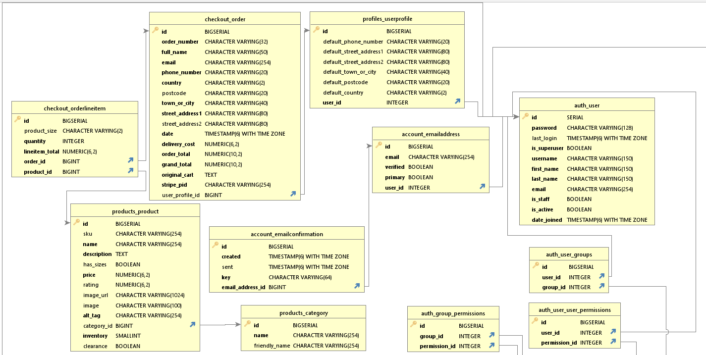


## The-Surface-Plane

### Design

### Colour-Scheme
The color scheme is a light weight scheme that offers trust and no rush. It is good through all seasons and works. Playful and Bright.


### Typography
These fonts are nice, clean and safe ato use. They are all standard fonts.

* logo-font - Cambria, Cochin, Georgia, Times, 'Times New Roman', serif;

* carousel caption -Impact, Haettenschweiler, 'Arial Narrow Bold', sans-serif;

* mc embed signup -Helvetica, Arial, sans-serif;

* reviews- Segoe UI, Tahoma, Geneva, Verdana, sans-serif;

### Imagery

The Website logo was was made by me.

The Slider Images was taken from Adobe Stock and a license was purchased for up too 500,000 views.

Poduct Images was taken from Adobe Stock and a license was purchased for up too 500,000 views.


## Technologies Used

### Languages Used

HTML, CSS, JavaScript, Python

### Database Used

sqlite3 for development.

[ElephantSQL](https://www.elephantsql.com/) for deployment.

### Frameworks Used

[Django](https://www.djangoproject.com/) - Version 3.2.16 - A high-level Python web framework that encourages rapid development and clean, pragmatic design.

[Bootstrap](https://getbootstrap.com/docs/4.6/getting-started/introduction/) - Version 4.6.2 - A framework for building responsive, mobile-first sites.

### Libraries & Packages Used

[jQuery](https://jquery.com/) - Version 3.4.2 - A JavaScript Framework

[Font Awesome](https://fontawesome.com/) - Version 6.2.1 - Used for the iconography of the site, this was added using a CDN link.

[Django Allauth](https://django-allauth.readthedocs.io/en/latest/) - Version 0.41.0 - Used for authentication, registration & account management.

[django-countries](https://pypi.org/project/django-countries/7.2.1/) - Version 7.2.1 - This is the latest stable version that is compatible with GitPod.

[django_crispy_forms](https://pypi.org/project/django-crispy-forms/) - provides a tag and filter that lets you quickly render forms

[gunicorn](https://pypi.org/project/gunicorn/) - a Python WSGI HTTP Server

[pillow](https://pypi.org/project/Pillow/) - Python imaging library

[dj_databsae_url](https://pypi.org/project/dj-database-url/) - allows us to utilise the DATABASE_URL variable

[psycopg2](https://pypi.org/project/psycopg2/) - a postgres database adapter which allow us to connect with a postgres database

[django-storages](https://pypi.org/project/django-storages/) - a storage backend library

[boto3](https://pypi.org/project/boto3/) - Allows connection to AWS S3 bucket

[coverage](documentation/testing/coverage/checkout-forms.png) - Used to see where there are areas of missing tests

[magnify.js](https://thdoan.github.io/magnify/) - Used to add the magnify lens to the product details product image

### Programs Used

[Am I Responsive](https://ui.dev/amiresponsive) - To create the responsive images of the site on a variety of device sizes.

[Balsamiq](https://balsamiq.com/) - Used to create wireframes.

[DrawSQL.app](https://drawsql.app/) - Used to create the database schema.

[Favicon.io](https://favicon.io/) - To create the favicon.

[Git](https://git-scm.com/) - For version control.

[GitHub](https://github.com/) - To save and store the files for this project.

[Google Dev Tools](https://developer.chrome.com/docs/devtools/) - To troubleshoot, test features and solve issues with responsiveness and styling.

[Pip](https://pypi.org/project/pip/) - A tool for installing Python packages.


[Tiny PNG](https://tinypng.com/) - To compress images used in the README.

### Stripe

[Stripe](https://stripe.com/gb) has been used in the project to implement the payment system.

Stripe for the website is currently in developer mode, which allows us to be able to process test payments to check the function of the site.

**Python Modules Used**

* Django Class and def function based views (Products, Offers, Reviews, Checkout, Profiles, Contact ) - Used for the classes to create, read, update and delete
* Allauth - was used to integrate a set of Django applications addressing authentication, registration and account authentication.
* Alert Messages - Login, Log Out to ensure that the user understands what actions have taken place.


### requirements.txt


asgiref==3.6.0
boto3==1.26.50
botocore==1.29.50
dj-database-url==0.5.0
Django==3.2
django-allauth==0.41.0
django-countries==7.2.1
django-crispy-forms==1.14.0
django-storages==1.13.2
gunicorn==20.1.0
jmespath==1.0.1
oauthlib==3.2.2
Pillow==9.4.0
psycopg2==2.9.5
python3-openid==3.2.0
pytz==2022.7
requests-oauthlib==1.3.1
s3transfer==0.6.0
sqlparse==0.4.3
stripe==5.0.0


## Testing
Some Hours Prior to Submission I noticed that on my phone has no credit card input field.
3/28/2023 at 10:59 

3/28/2023 after hours of trial and error. It was the async tag in the meta causing the error.
11:24

I had Tutor support and Daisy Mc Girr test Web and Mobile with no errors or problems-

Making me nervous

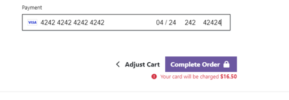

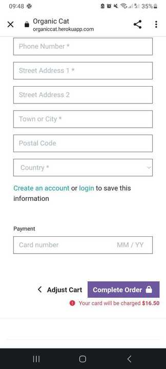

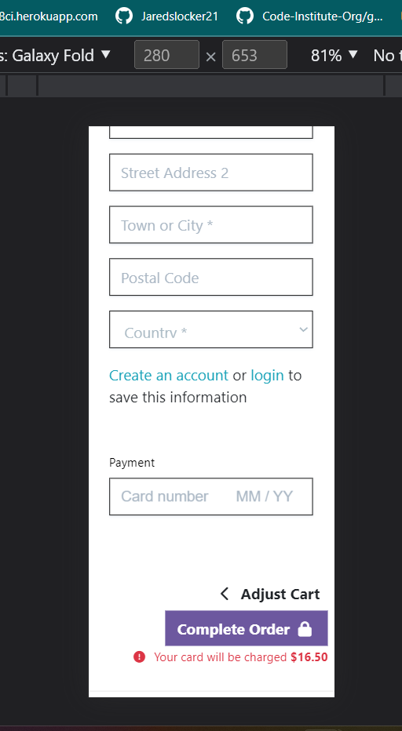

**Mobile Test Images** 


* [Nav Search](docs/readme_images/mobile/nav-search.PNG)
* [Product Page](docs/readme_images/mobile/product-page.PNG)
* [Product Detail](docs/readme_images/mobile/product-detail.PNG)
* [Checkout Form](docs/readme_images/mobile/checkout-form.PNG)
* [Checkout](docs/readme_images/mobile/checkout-form.PNG)
* [empty-cart](docs/readme_images/mobile/empty-cart.PNG)
* [Profile](docs/readme_images/mobile/footer-top.PNG)
* [Reviews](docs/readme_images/mobile/)
* [toasts](docs/readme_images/mobile/inventory-toast.PNG)
* [inventory-error-toast](docs/readme_images/mobile/)
* [Account Icons](docs/readme_images/mobile/account-icon.PNG)
* [contact us form](docs/readme_images/mobile/)
* [mail chimp footer](docs/readme_images/mobile/mail-chimpfooter.PNG)

* The majority of Test cases and results can be found in the [TESTING.md](TESTING.md) file. This was moved due to the size of the file.

* STRIPE Manual Tests- many manual tests occurred. I only documented success

 

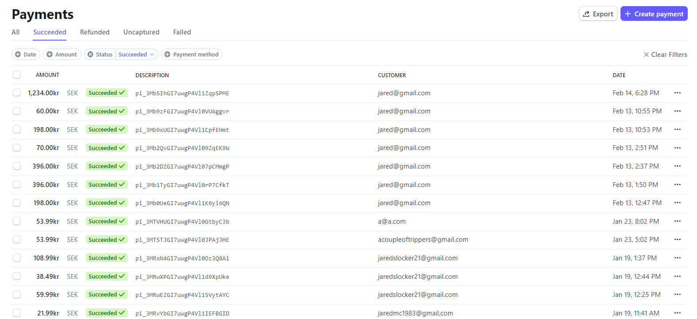

* E-MAil Recieved - This is the manual test.

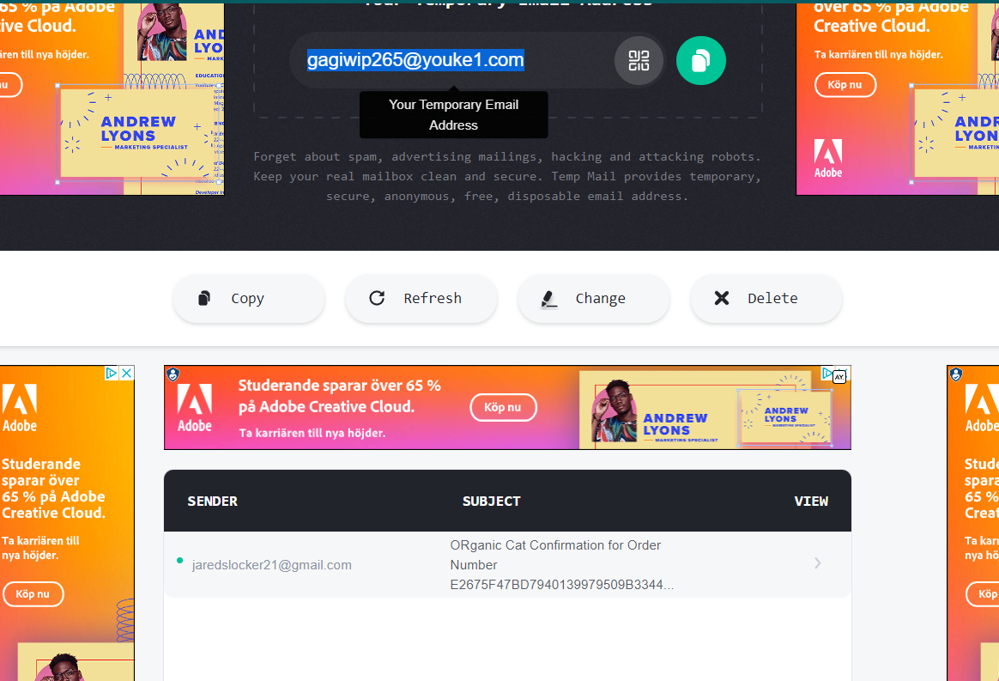


## Deployment

### Version Control

The site was created using the Github!

The following git commands were used throughout development to push code to the remote repo:

```git add <file>``` - This command was used to add the file(s) to the staging area before they are committed.

```git commit -m “commit message”``` - This command was used to commit changes to the local repository queue ready for the final step.

```git push``` - This command was used to push all committed code to the remote repository on github.

### Heroku Deployment
The project is deployed using Heroku. To deploy the project:

#### **Create active Database**

We have been using the sqlite3 database in development, however this is only available for use in development so we will need to create a new external database which can be accessed by Heroku.

1. Go to the [ElephantSQL](https://www.elephantsql.com/) dashboard and click the create new instance button on the top right.
2. Name the plan after your project, select tiny turtle free plan and choose the region that is closest to you then click the review button.
3. Check the details are all correct and then click create instance in the bottom right.
4. Dashboard and select the database just created.
5. Copy the URL 

#### **Heroku app setup**

  1. From the [Heroku dashboard](https://dashboard.heroku.com/), click the new button in the top right corner and select create new app.
  2. Give your app a name (this must be unique), select the region that is closest to you and then click the create app button bottom left.
  3. Open the settings tab and create a new config var of `DATABASE_URL` and paste the database URL you copied from elephantSQL into the value (the value should not have quotation marks around it).

#### **Preparation for deployment in GitPod**

1. Install dj_database_url and psycopg2:

   ```bash
   pip3 install dj_database_url==0.5.0 psycopg2
   ```

2. Update your requirements.txt file with the packages just installed:

    ```bash
    pip3 freeze > requirements.txt
    ```

3. In settings.py underneath import os, add `import dj_database_url`

4. Find DATABASES  comment out code. Add the following code below the commented out database block, use the URL copied from elephantSQL for the value:

    (NOTE! don't delete the original section, as this is a temporary step whilst we connect the external database. Make sure you don't push this value to GitHub - this value should not be saved to GitHub, it will be added to the Heroku config vars in a later step, this is temporary to allow us to migrate our models to the external database)

    ```python
    DATABASES = {
        'default': dj_database_url.parse('paste-elephantsql-db-url-here')
    }
    ```

5. Run the show migrations in terminal to confirm connection to the external database:

    ```bash
    python3 manage.py runserver
    ```

6. You will see a list of migrations that are unchecked. You can  run makemigrations and migrate to the new database:

    ```bash
    python3 manage.py migrate
    ```

7. Create a superuser for the new database. Input a username, email and password when directed.

    ```bash
    python3 manage.py createsuperuser
    ```

8. You should now be able to go to the browser tab on the left click  table queries button and see the user you've just created by selecting the auth_user table.
9. We can now add an if/else statement for the databases in settings.py, so we use the development database while in development (the code we commented out) - and the external database on the live site (note the change where the db URL was is now a variable we will use in Heroku):

    ```python
    if 'DATABASE_URL' in os.environ:
        DATABASES = {
          'default': dj_database_url.parse(os.environ.get('DATABASE_URL'))
        }
    else:
        DATABASES = {
            'default': {
                'ENGINE': 'django.db.backends.sqlite3',
                'NAME': os.path.join(BASE_DIR, 'db.sqlite3')
          }
        }
    ```

10. Install gunicorn which will act as our webserver and freeze this to the requirements.txt file:

    ```bash
    pip3 install gunicorn
    pip3 freeze > requirements.txt
    ```

11. Create a `Procfile` in the root directory. This tells Heroku to create a web dyno which runs gunicorn and serves our django app. Add the following to the file (making sure not to leave any blank lines underneath):

    ```Procfile
    web: gunicorn seaside_sewing.wsgi:application
    ```

12. Log into the Heroku CLI in the terminal and then run the following command to disable collectstatic. This command tells Heroku not to collect static files when we deploy:

    ```bash
    heroku config:set DISABLE_COLLECTSTATIC=1 --app heroku-app-name-here
    ```

13. We will also need to add the Heroku app and localhost (which will allow GitPod to still work) to ALLOWED_HOSTS = [] in settings.py:

    ```python
    ALLOWED_HOSTS = ['{heroku deployed site URL here}', 'localhost' ]
    ```

14. Save, add, commit and push the changes to GitHub. You can then also initialize the Heroku git remote in the terminal and push to Heroku with:

    ```bash
    heroku git:remote -a {app name here}
    git push heroku master
    ```

15. You should now be able to see the deployed site (without any static files as we haven't set these up yet).

16. To enable automatic deploys on Heroku, go to the deploy tab and click the connect to GitHub button in the deployment method section. Search for the projects repository and then click connect. Click enable automatic deploys at the bottom of the page.

#### **Generate a SECRET KEY & Updating Debug**

1. Django automatically sets a secret key , we shouldn't use this default key in the deployed version, it leaves our site vulnerable. We can use a random key generator to create a new SECRET_KEY which we can then add to our Heroku config vars which will then keep the key protected.
2. [Django Secret Key Generator](https://miniwebtool.com/django-secret-key-generator/) is an example of a site we could use to create our secret key. Create a new key and copy the value.
3. In Heroku settings create a new config var with a key of `SECRET_KEY`. The value will be the secret key we just created. Click add.
4. In settings.py we can now update the `SECRET_KEY` variable, asking it to get the secret key from the environment, or use an empty string in development:

    ```python
    SECRET_KEY = os.environ.get('SECRET_KEY', ' ')
    ```

5. We can now adjust the `DEBUG` variable to only set DEBUG as true if in development:

    ```python
    DEBUG = 'DEVELOPMENT' in os.environ
    ```

6. Save, add, commit and push these changes.

#### **Set up AWS hosting for static and media files**

! NOTE: These instructions are for setting up AWS hosting as of 5/1/23 - these may change slightly in future versions of AWS.

1. Sign up or login to your [aws amazon account](https://aws.amazon.com) on the top right by using the manage my account button and then navigate to S3 to create a new bucket.
2. The bucket will be used to store our files, so it is a good idea to name this bucket the same as your project. Select the region closest to you. In the object ownership section we need to select ACLs enabled and then select bucket owner preferred. In the block public access section uncheck the block public access box. You will then need to tick the acknowledge button to make the bucket public. Click create bucket.
3. Click the bucket you've just created and then select the properties tab at the top of the page. Find the static web hosting section and choose enable static web hosting, host a static website and enter index.html and error.html for the index and error documents (these won't actually be used.)
4. Open the permissions tab and copy the ARN (amazon resource name). Navigate to the bucket policy section click edit and select policy generator. The policy type will be S3 bucket policy, we want to allow all principles by adding `*` to the input and the actions will be get object. Paste the ARN we copied from the last page into the ARN input and then click add statement. Click generate policy and copy the policy that displays in a new pop up. Paste this policy into the bucket policy editor and make the following changes: Add a `/*` at the end of the resource value. Click save.
5. Next we need to edit the the cross-origin resource sharing (CORS). Paste in the following text:

    ```json
    [
        {
            "AllowedHeaders": [
                "Authorization"
            ],
            "AllowedMethods": [
                "GET"
            ],
            "AllowedOrigins": [
                "*"
            ],
            "ExposeHeaders": []
        }
    ]
    ```

6. Now we need to edit the access control list (ACL) section. Click edit and enable list for everyone(public access) and accept the warning box.

#### **Creating AWS groups, policies and users**

1. Click the services icon on the top right of the page and navigate to IAM - manage access to AWS services. On the left hand navigation menu click user groups and then click the create group button in the top right. This will create the group that our user will be placed in.
2. Choose a name for your group - for example manage-seaside-sewing, and click the create policy button on the right. This will open a new page.
3. Click on the JSON tab and then click the link for import managed policy on the top right of the page.
4. Search for S3 and select the one called AmazonS3FullAccess, then click import.
5. We need to make a change to the resources, we need to make resources an array and then change the value for resources. Instead of a `*` which allows all access, we want to paste in our ARN. followed by a comma, and then paste the ARN in again on the next line with `/*` at the end. This allows all actions on our bucket, and all the resources in it.
6. Click the next: tags button and then the next:review .
7. Give the policy a name and description (e.g. seaside-sewing-policy | Access to S3 bucket for seaside sewing static files.) Click the create policy button.
8. Now we need to atach the policy we just created. On the left hand navigation menu click user groups, select the group and go to the permissions tab. Click the add permissions button on the right and choose attach policies from the dropdown.
9. Select the policy you just created and then click add permissions at the bottom.
10. Now we'll create a user for the group by clicking on the user link in the left hand navigation menu, clicking the add users button on the top right and giving our user a username (e.g. seaside-sewing-staticfiles-user). Select programmatic access and then click the next: permissions button.
11. Add the user to the group you just created and then click next:tags button, next:review button and then create user button.
12. You will now need to download the CSV file as this contains the user access key and secret access key that we need to insert into the Heroku config vars. Make sure you download the CSV now as you won't be able to access it again.

#### **Connecting Django to our S3 bucket**

1. Install boto3 and django storages and freeze them to the requirements.txt file.

    ```bash
    pip3 install boto3
    pip3 install django-storages
    pip3 freeze > requirements.txt
    ```

2. Add `storages` to the installed apps in settings.py
3. Add the following code in settings.py to use our bucket if we are using the deployed site:

    ```python
    if 'USE_AWS' in os.environ:
        AWS_S3_OBJECT_PARAMETERS = {
            'Expires': 'Thu, 31 Dec 2099 20:00:00 GMT',
            'CacheControl': 'max-age=9999999',
        }
        
        AWS_STORAGE_BUCKET_NAME = 'enter your bucket name here'
        AWS_S3_REGION_NAME = 'enter the region you selected here'
        AWS_ACCESS_KEY_ID = os.environ.get('AWS_ACCESS_KEY_ID')
        AWS_SECRET_ACCESS_KEY = os.environ.get('AWS_SECRET_ACCESS_KEY')
        AWS_S3_CUSTOM_DOMAIN = f'{AWS_STORAGE_BUCKET_NAME}.s3.amazonaws.com'
    ```

4. In Heroku we can now add these keys to our config vars:

    | KEY | VALUE |
    
    | AWS_ACCESS_KEY_ID | The access key value from the amazon csv file downloaded in the last section |

    | AWS_SECRET_ACCESS_KEY | The secret access key from the amazon csv file downloaded in the last section |

    | USE_AWS | True |


5. Remove the DISABLE_COLLECTSTATIC variable.

6. Create a file called custom_storages.py in the root and import settings and S3Botot3Storage. Create a custom class for static files and one for media files. These will tell the app the location to store static and media files.

7. Add the following to settings.py to let the app know where to store static and media files, and to override the static and media URLs in production.

    ```python
    STATICFILES_STORAGE = 'custom_storages.StaticStorage'
    STATICFILES_LOCATION = 'static'
    DEFAULT_FILE_STORAGE = 'custom_storages.MediaStorage'
    MEDIAFILES_LOCATION = 'media'
    
    STATIC_URL = f'https://{AWS_S3_CUSTOM_DOMAIN}/{STATICFILES_LOCATION}/'
    MEDIA_URL = f'https://{AWS_S3_CUSTOM_DOMAIN}/{MEDIAFILES_LOCATION}/'
    ```


8. Save, add, commit and push these changes to make a deployment to Heroku. In the build log you should be able to see that the static files were collected, and if we check our S3 bucket we can see the static folder which has all the static files in it.

9. Navigate to S3 and open your bucket. We now want to create a new file to hold all the media files for our site. We can do this by clicking the create folder button on the top right and naming the folder media.

#### **Setting up Stripe**


1. We now need to add our Stripe keys to our config vars in Heroku to keep these out of our code and keep them private. Log into Stripe, click developers and then API keys.

2. Create 2 new variables in Heroku's config vars - for the publishable key (STRIPE_PUBLIC_KEY) and the secret key (STRIPE_SECRET_KEY) and paste the values in from the Stripe page.

3. Now we need to add the WebHook endpoint for the deployed site. Navigate to the WebHooks link in the left hand menu and click add endpoint button.

4. Add the URL for our deployed sites WebHook, give it a description and then click the add events button and select all events. Click Create endpoint.

5. Now we can add the WebHook signing secret to our Heroku config variables as STRIPE_WH_SECRET.

6. In settings.py:

    ```python
    STRIPE_PUBLIC_KEY = os.getenv('STRIPE_PUBLIC_KEY', '')
    STRIPE_SECRET_KEY = os.getenv('STRIPE_SECRET_KEY', '')
    STRIPE_WH_SECRET = os.getenv('STRIPE_WH_SECRET', '')
The app should now be deployed.

## Credits 
- My Mentor Akshat Garg and Daisy Mc Girr have really supported me technically through this project.
- The Default Image, Hero Image are  Adobe Stock Images licenses were purchased through my monthly subscription up too 500k views.
- Logo- The logo was made by me. Not the Font. The Font is a Catfont
- Tutor Support on a few occassions. Thank You! 
- The slack community has also helped to keep me cool and engaged.
- Lauren-Nicole helped me with some design.
- Al-Amin Sanusi helped with moral as an ear to talk to and work out problems and issues
- “I think therefore I blog” walkthrough: Provided initial steps for setting up & deploying the site.  
- "I think therefore I blog" + "Hello Django" + Slack + Stackoverflow + other pupils helped in the creation of the totality.


## Must HAVES
#### must be included in PP5 -

* 3 unique Models -  

- Product Model. Has been adapted to my project as I added alt_tag and inventory tracking in the administration, product detail and cart.
  I believe that inventory tracking is very important so with research and help it works and subtracts the total from the administration display.
  Messages are displayed  when those who try to buy a product over the amount in inventory are denied and it does reflect in the messaging.
  Added Inventory Tracking to the Product model and I replaced product.name with alt_tag as a django template tag. It is a rudamentry function that 
  adjusts an interger set in the product model 
  
  While being a Commerce\E-Commerce Event Manager myself, we know that the Product Name can be and very often is different than the alt_tag when 
  uploading images.

- Offers Model is a model that I made up. It allows the admin to update the slider images and slider captions. I believe that there can be more done for the admin to put in an image that is not sized right. Product managers and the back-end administration and this adds more function for them. But this is a good start. The offers model allow you to also change the text of the slider caption.

- Reviews Model. Has been researched on the internet support, previous projects, and adapted to my project.  

- Contact Model- This was added model has come from research and friends, and has been adapted to this project as this model is widely used.
I believe that every E-Commerce store should have a contact form for which I used SUPPORT as the button in the footer. 
I believe that giving and reeiving support is more pro active to what their inquiry is. You will be able to receive SUPPORT - 
  
  
## must be included in PP5 - 
### SEO implementation, including:

* Descriptive meta tags - check
* rel attributes on links to external resources -check
* sitemaps.txt -check
* robots.txt -check

### Marketing techniques, including:

* The need for the creation of either a real Facebook business page, or a mockup of one.
* A newsletter signup form, either through a service such as MailChimp or through a custom implemented one.
* mailchimp and GDPR   -check
* Facebook Page  -check
* Agile -check, kanban
### Other common stumbling blocks that students encounter on submission of their E-Commerce Applications Portfolio Projects:

* A custom 404 error page must be implemented for improved overall UX. -check
* procfile -check 
* Default to False  -check
* Form Front- End Form - check
* CRUD - eviews - profile - product management - check


