Welcome To Organic Cat -

Organic Cat is my Fifth Portfolio Project for my Level 5 Diploma in Web Application Development with the Code Institute.
I particularly liked this project because my partner and my daughter whom both have multiple's of cats helped me find products 
and gave me inspiration. 

It is a Full Stack, multi-application, E-Commerce site with the ability to
take Stripe Payments. This site also delivers a powerful administration for the site owner or business administration.
I hope you enjoy.


The live link can be found here: [Live Site](https://organiccat.herokuapp.com/)

## Table of Contents
* [User Experience Design (UX)](#User-Experience-Design)
    * [The Strategy Plane](#The-Strategy-Plane)
        * [Site Goals](#Site-Goals)
        * [Market Analysis](#Market-Analysis)   
        * [Seo Implementation](#SEO-IMPLEMENTATION) 
        * [Agile Planning](#Agile-Planning)
          * [Epics and user stories](#epics-and-user-stories)
    * [The Scope Plane](#The-Scope-Plane)
    * [The Structure Plane](#The-Structure-Plane)
      * [Features](#Features)
      * [Future Features](#Features-Left-to-Implement)
    * [The Skeleton Plane](#The-Skeleton-Plane)
        * [Wireframes](#Wireframes)
        * [Database Design](#Database-Design)
        * [Security](#Security)
    * [The Surface Plane](#The-Surface-Plane)
        * [Design](#Design)
            * [Colour Scheme](#Colour-Scheme)
            * [Typography](#Typography)
            * [Imagery](#Imagery)
* [Technologies](#Technologies)
* [Testing](#Testing)
* [Deployment](#Deployment)
    * [Version Control](#Version-Control)
    * [Heroku Deployment](#Heroku-Deployment) 
* [Credits](#Credits)
  * [Content](#Content)
  * [Acknowledgements](#Acknowledgements)
  * [Must Haves](#Version-Control)

# User-Experience-Design

## The-Strategy-Plane

### Site-Goals
* Organic Cat is a Busines to Consumer- B-2C, E-Commerce website.

- The sites primary audience will be people who love cats and are interested in organic treats and natural materials.
- Old, young, and everyone who owns a cat. 
- Market Analysis shows massive growth in this area and further that Organic and Sustainable product demands are on the rise. 

* Deploy a Full Stack E-Commerce website, including STRIPE payments, additionally with back-end administration.  

## Market analysis
* "Cats are the second-largest consumers of pet food in the world."
* "The Cat Food Market is growing at a CAGR of 5.3% over the next 5 years."
* "CAGR - CAGR stands for the Compound Annual Growth Rate. It is the measure of an investment’s annual growth rate over time, with the effect of compounding taken into account. It is often used to measure and compare the past performance of investments or to project their expected future returns. The CAGR formula is equal to (Ending Value/Beginning Value) ^ (1/No. of Periods) – 1.
* "Middle East and Africa is growing at the highest CAGR over 2018 - 2028."
* "Europe holds the highest share in 2021." mordorintelligence.com

* Europe continues to dominate the global cat food market. The popularity of cats continued to increase during the last century in the region, according to various studies. The number of cat owners increased more than dog owners due to the relative ease of having a cat as a pet in the modern lifestyle. Dry, wet, and semi-moist food are the major types of commercial cat food.

* "Germany, the largest economy in the European Union, is a big and promising cat food market. The German industry is mature munchableat saturated, although it is steadily growing. German cat owners are trending toward products that ‘humanize’ the care of their cats, and in response, manufacturers have developed premium cat foods focusing on health and wellness. The trends in the cat food sector often correspond to those in human nutrition. Companies are offering an increasing number of premium products as consumers are prepared to spend more on pet food that is healthy, nutritious, and improves their living conditions. For instance, in 2020, the German pet treat company Gimborn launched a line of functional pet treats. The products include squeezables, oil-based liquid treats, and munchables and crunchy treats for cats. The consumer trend toward cat adoption has driven cat food premiumization, which is anticipated to create an expansion of the cat food market over the forecast period."
According to the lates research.Cat accessories is set to witness high growth during the time period 2023-2031.

* "Additionally, pet ownership and purchasing behavior have remained unchanged from May to June 2020. As per the APPA report, there was no significant change in pet owners being financially cautious about their pet product spending, with a majority (64.0%) spending the same amount from May to June."

* "Government agencies, pet food manufacturers, retailers, and veterinarians play crucial roles in ensuring the safety of cat food and safeguarding pets and their owners. Recent legislation is expected to increase the government’s role in regulating cat food and may affect many manufacturers"

* [Site: Mordor Report](https://www.mordorintelligence.com/industry-reports/global-cat-food-market-industry) 
 


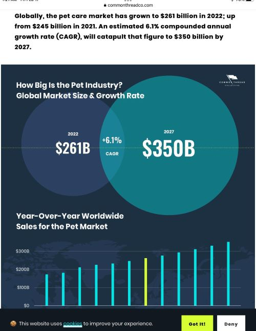

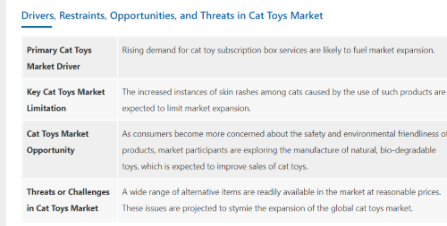


### SEO IMPLEMENTATION

* Choose a business idea to do your keyword research for.

* Natural Cat Products, cats, organic food, cat food, kats, kittens, healthy, pets, accessories, pet care, 

* "Keyword research is not an exact science. The volume and popularity of keywords constantly shifts. This means that deciding on keywords for a project is just the beginning of a journey, and marketing departments for e-commerce businesses have to continuously analyse and adjust them." CI 

* rel="noopener" in an <a>a</a> tag for social icons -check

* use the <strong> strong </strong> attribute, both visual and seo's see these tags. -some -check

* Metadata is always in the head and the most valuable to search engines. Anna Greives "Keyword stuff to the maximum" 

* Add descrptive alt_tags. I added it to my product model

* Facebook [facebook](https://www.facebook.com/profile.php?id=100090668165486)

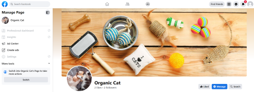

### Agile Planning

This project was developed using agile methodologies by delivering small features in incremental sprints. There were 4 sprints in total, spaced out evenly over 4 weeks.

All projects were assigned to epics and user stories, prioritized under the labels. User Stories were assigned to Epics and Epics were assigned to sprints. It was done this way to ensure that all core requirements were completed first to maintain completion. More aesthetic User Stories were added near last sprint. 

(This is a personal decision as per how my mind and anxieties work. Tech before aesthetics and MVC.)

Initial Design comes parrarelel with tech and more aesthetic design continues until completion.


The Kanban board was created using github projects and can be located [here] and can be viewed to see more information on the project cards. 


#### Epics and User Stories
The following user stories (by epic) were completed over the 4 sprints:
The project had 9 main Epics (milestones):

**EPIC: 1 Developer Set-UP User Stories**

As a developer, I need to create the base.html page and structure so that other pages can reuse the layout

As a developer, I need to create static resources so that images, css and javascript work on the website

As a developer, I need to create the django apps that allow me work on the website

As a developer, I need to set up the project so that it is ready for implementing the core features

As a developer, I need to create the footer with social media links and contact information

As a developer, I need to create the navbar so that users can navigate the website from any device

**EPIC 2: Home Page Contents**

As a Developer, I want to add Homepage Photo

As a Developer, I want to add Categories

As a Developer, I want to add Products

As a Developer, I want to add Accessories

As a Developer, I want to add Special Offers

As a Developer, I want to add Like/Heart Button

As a Site User, I would like to be able to view all Products, Accessories, and Special offers to help me make good shopping decisions

**EPIC 3: Page Function**

As a Customer, I want to be able to search the ecommerce page.

As an Admin user, I want to be able to login and logout.

As a Developer, I need to implement a 404 error page to alert users when they have accessed a page that doesn't exist

As a Site User, I would like a "About" page so that I can view information on this website

Aa a Site Admin, I can update products in the admin backend.

As a Site Admin I can approve edit and delete staff members.

**EPIC 4: Viewing and Navigation**

As a developer I must revisit, refactor, fix bugs""

As a Shopper I can view a home page so that lovely introduction too site

As a Shopper I can view a list of buttons so that select something to purchase

As a Shopper I can view a cart icon so that I can see how much cost I accumulate

As a Shopper I can view a list of products so that select something to purchase

As a Shopper I can view a specific category of products so that quickly find products I am interested in

As a Shopper I can view items that are on sale and clearances so that save money on purchases

As a Shopper I can view a total of my purchases so that avoid spending too much


**EPIC 5: Registration and User Accounts**

As a developer I must developa registration account function that allows users to make a profile so that fulfil

As a developer I must develop the ability to log in and logout with django allauth so that security tokens are used

As a developer I must develop **the ability for users to recover their password **so that everyone feels secure and site maintains secure

As a developer I must develop user profile so that the user can log in and out

As a Site User I can Easily Register for an account so that I have a personal account to be able to view my profile

As a Site User I can Easily Log In and Log Out so that Access my personal account

As a Site User I can **Easily Recover my password ** so that Recover access to my account

As a Site User I can Have a personalized user profile so that View my personal order history and payment information 

**EPIC 6: Sorting and Searching**

As a Shopper I can sort the list of available products so that Easily identify best price, categories and sorted products

As a Shopper I can sort a specific category so that Easily identify best price, best rated, and sort by categories

As a Shopper I can search by product name, description, so that Find a specific product to purchase

As a Shopper I can Easily search for what I have searched for and the number of results so that I can quickly find the availability of the product

**EPIC 7: Purchasing and Checkout**

As a Developer I can add a cart app so that **the shopper can add items to the cart **

As a Developer I can a checkout app so that the shopper can view bag items and make a purchase

As a Developer I can add an edit cart functions so that shopper can edit cart contents

As a Developer I can add a payment method so that shoppers can purchase through my website

As a Shopper I can add items to the cart so that they will be organized in one place

As a Shopper I can view items in cart through the checkout so that they can edit and make a purchase

As a Shopper I can edit items in the cart through the checkout so that the shopper can add or subtract items in the cart

As a Shopper I can make safe purchases so that supply payment information and return to the store for more purchase in the future

**EPIC 8: Admin and Store Management**

As a developer I can add a product function to give to the store owner so that the store has new products

As a developer I can add edit and update functions so a product functionality so that when prices, descriptions, and images change I can also change them

As a developer I can add delete functions so that Items can be removed when not in stock or no longer work

As a store owner I can add a product ** so that my store has new products

As a store owner I can edit and update a product ** so that when prices, descriptions and images change I can also change them

As a store owner I can delete **** so that Items can be removed when not in stock or no longer work

**EPIC 9: Read Me and Testing file**

As a developer I must document everything so that I can continue to develop my skills

As a developer I must test every function so that I can work out bugs and 

* Complete readme documentation


## The-Scope-Plane

* Fully Functioning E-Commerce Application - Guests and Commerce

* Backend administration controls. For Admin

* Responsive Design - Site should be fully functional on all devices from 320px up for Mobile device usage

* User Profiles - Make Purchases, reviews, contact form, mail chimp, Sign Up for accounts, password recovery, purchase, adjust order,   

* Users Admin - Icons for Accounts Both user and Product managers camn access, update, edit and delete products

* User Guests - Make Purchases, contact form, mail chimp.

* Hamburger menu for mobile devices and a reduced screen size

* Ability to perform CRUD functionality for Members 

* Restricted role based features

* 


## The-Structure-Plane

### Features

Implementation:

**Navigation Menu**

 The Navigation contains drop-down menus

The following navigation items are available.

  * Home -> index.html - View home 
  
  * All Products -> Price, Rating, Category, All Products
  
  * Food -> Dry Food, Wet Food, Snacks, All Food
  
  * Accessories -> collars,brushes, trees, bowls, beds, toys
  
  * Offers -> New Arrivals, Deals, Clearance, All Specials
  
  * My Account -> logout.html - Visible to logged in users
  
  * Cart -> 
  
Implementation:

**Home Page**

The home page contains 3 slider images of the whole idea of the store. Cat accessories, cats with toys, organically grown catnip with a bee, 
 with captions\calls to action. The Navigation bar is super open, elegant, and fixed to the top while you scroll.
 
This will immediately make it evident to the user, what the purpose of the website is. Products for your feline friends. 

The navigation menu is displayed on all pages and drops down into a hamburger menu on smaller devices. 
This will allow users to view the site from any device and not take up too much space on mobile devices.

* Navigation Bar


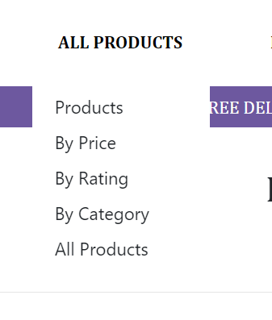

* Logo


* Slider Image plus CTA.


* Account and Cart Icons

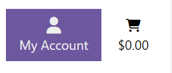


* Free Delivery Threshold banner


Implementation:

**Footer**

A footer has been added to the bottom of the site, this contains a Twitter and Facebook link so that users can follow the Your Community blog on social media'


* Sign in Page 


Implementation:

**View Product Detail Page**

A Product Page. 


Implementation:

**View Product Detail Page**

A Product Detail Page. 


* Not Signed In 


Implementation:

**Register Page**

Create customer profile was implemented to allow staff users to view orders via the UI without having to use the backend admin panel.


**Reviews Section**


**Grand Total**


**Checkout**

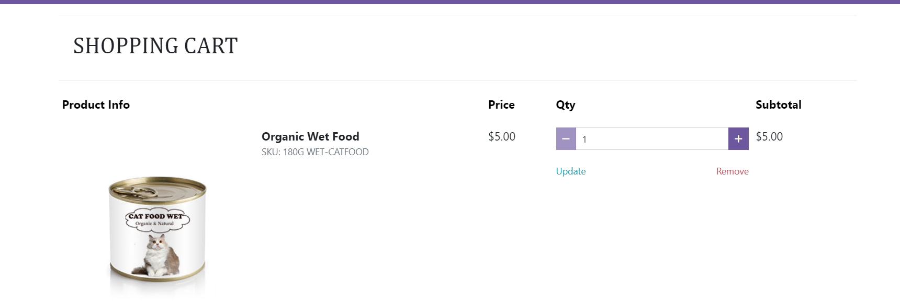

**Signed OUT**

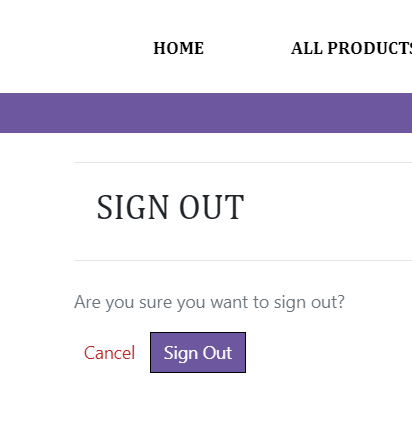

**Product Management Page Form**

* Edit Button and Delete Button

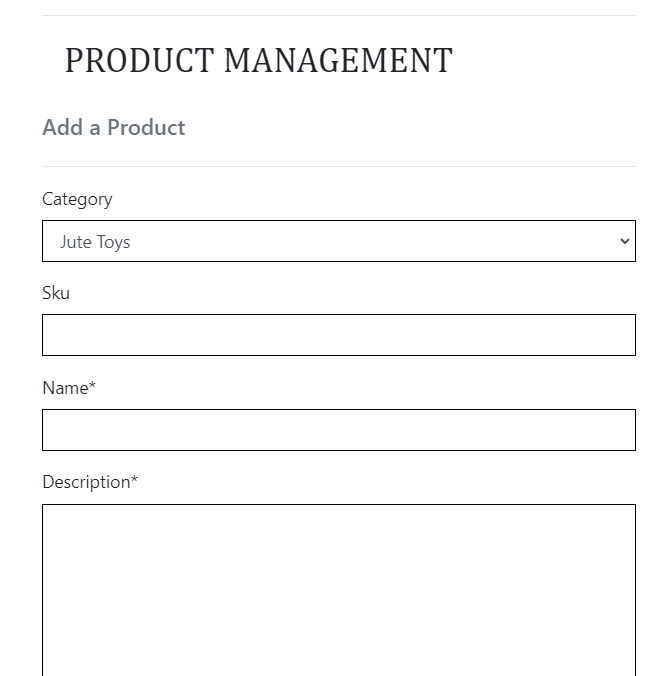

**Profile Page Form**

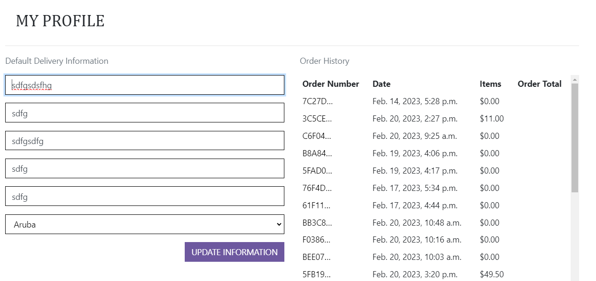

**Delete Product**

No Page was created. A message alert was created notifying the user that the page was deleted.

Implementation:

**Alert Message**

Generic Alert messages were used to inform members of their actions

* Add Product Message -successful test of message


* Inventory Error Message -successful test 

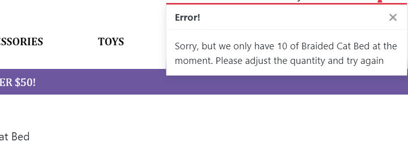


* Remove Product Success From Cart -successful test


* Payment Success - successful test


* Deleted Message


Implementation:

**Error Pages**

Implementation:

**404 Message**
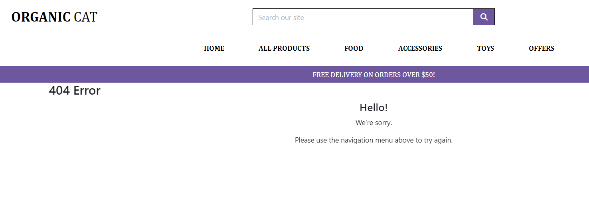

**500 Message** 


The 404 message will allow the user to easily understand what is occuring.
This covers: The occurances happen in the pages below. It is implemented into the code with a
using a basic django message. 

* Bad Url 
* Product Details - get_object_or404
* Reviews - get_object_or_404

Implementation:

**Base Setup User Stories**

The following stories were implemented in order to set up a base structure for all the HTML pages and the core installations and configurations needed to run the application. While these do not show as individual features, they were stories completed that were needed to implement all of the stories above.

As I am a student I will most likely revisit some of these ideas as making migrations or adjusting to design and learning curve. 

``As a developer, I need to create the base.html page and structure so that other pages can reuse the layout``

``As a developer, I need to create static resources so that images, css and javascript work on the website``

``As a developer, I need to set up the project so that it is ready for implementing the core features``

**Favicon**

  * A site wide favicon was implemented.
  * This provides an image in the tabs header to allow the user to easily identify the website if they have multiple tabs open.


### Features Left To Implement

## The-Skeleton-Plane

### Wireframes Computer and Mobile

Wire frames were also created as a rough sketch to represent obejects within the site.

This is the home page.


This is the Product page.


This is a wire frame Product Detail Page


This is a wire frame Checkout


This is a wire frame Checkout Success 


Profile Page- Gives the user CRUD Functions for delivery 


Implementation:
### Database-Design

* Data Design as an E-Commerce. Product Data Base that allows the administration full CRUD and to those Product Managers CRUD functions for the front end in the nav bar.

* Users also have CRUD functions for their Profile to change their Profile delivery Information and to view their pruchase history.

* Reviews also gives users the ability for CRUD functions and they are aloud while logged in to Create, Read, Update or Delete their reviews.

* Entity relationship diagram was created using [DBVisualizer](https://www.dbvis.com/) and shows the schemas for each of the models and how they are related.

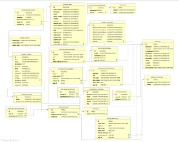


## The-Surface-Plane

### Design

### Colour-Scheme


### Typography


### Imagery

The Website logo was was made by me.

The Slider Images was taken from Adobe Stock and a license was purchased for up too 500,000 views.

Poduct Images was taken from Adobe Stock and a license was purchased for up too 500,000 views.

## Technologies

- HTML
  - The structure of the Website was developed using HTML as the main language.
- CSS
  - The Website was styled using custom CSS in an external file.
- JavaScript
  - JavaScript was used to make the Site Pagination.
- Python
  - Python was the main programming language used for the application using the Django Framework.
- Visual Studio Code
  - The website was developed using Visual Studio Code IDE
- GitHub
  - Source code is hosted on GitHub
- Git
  - Used to commit and push code during the development of the Website
- Font Awesome
  - This was used for various icons throughout the site
- Favicon.io
  - favicon files were created at https://icons8.com/ and no license is required if I share this link with the whole world. 
- balsamiq
  - wireframes were created using balsamiq from https://balsamiq.com/wireframes/desktop/#
- Canva
  - The Diagram at the top of the page
- TinyPNG
  - This was used to compress the hero images for optimal load times

**Python Modules Used**

* Django Class and def function based views (Products, Offers, Reviews, Checkout, Profiles, Contact ) - Used for the classes to create, read, update and delete
* Allauth - was used to integrate a set of Django applications addressing authentication, registration and account authentication.
* Alert Messages - Login, Log Out to ensure that the user understands what actions have taken place.


### requirements.txt


asgiref==3.6.0
boto3==1.26.50
botocore==1.29.50
dj-database-url==0.5.0
Django==3.2
django-allauth==0.41.0
django-countries==7.2.1
django-crispy-forms==1.14.0
django-storages==1.13.2
gunicorn==20.1.0
jmespath==1.0.1
oauthlib==3.2.2
Pillow==9.4.0
psycopg2==2.9.5
python3-openid==3.2.0
pytz==2022.7
requests-oauthlib==1.3.1
s3transfer==0.6.0
sqlparse==0.4.3
stripe==5.0.0


## Testing

* The majority of Test cases and results can be found in the [TESTS.md](TESTS.md) file. This was moved due to the size of the file.

* STRIPE Manual Tests- many manual tests occurred. I only documented success

 


* E-MAil Recieved - This is the manual test.


## Deployment

### Version Control

The site was created using the Github!

The following git commands were used throughout development to push code to the remote repo:

```git add <file>``` - This command was used to add the file(s) to the staging area before they are committed.

```git commit -m “commit message”``` - This command was used to commit changes to the local repository queue ready for the final step.

```git push``` - This command was used to push all committed code to the remote repository on github.

### Heroku Deployment

The site was deployed to Heroku. The steps to deploy are as follows:

- Navigate to heroku and create an account
- Click the new button in the top right corner
- Select create new app
- Enter app name
- Select region and click create app
- Click the resources tab and search for Heroku Postgres
- Select hobby dev and continue
- Go to the settings tab and then click reveal config vars
- Add the following config vars:
  - SECRET_KEY: (Your secret key)
  - DATABASE_URL: (This should already exist with add on of postgres)
  - EMAIL_HOST_USER: (email address)
  - EMAIL_HOST_PASS: (email app password)
  - CLOUNDINARY_URL: (cloudinary api url)
- Click the deploy tab
- Scroll down to Connect to GitHub and sign in / authorize when prompted
- In the search box, find the repositoy you want to deploy and click connect
- Scroll down to Manual deploy and choose the main branch
- Click deploy

The app should now be deployed.

The live link can be found here: [Live Site]()

## Credits 
- My Mentor Akshat Garg and Daisy Mc Girr have really supported me technically through this project.
- The Default Image, Hero Image are  Adobe Stock Images licenses were purchased through my monthly subscription up too 500k views.
- Logo- The logo was made by me. Not the Font. The Font is a Catfont
- Tutor Support on a few occassions. Thank You! 
- The slack community has also helped to keep me cool and engaged.
- Lauren-Nicole helped me with some design.
- Al-Amin Sanusi helped with moral as an ear to talk to and work out problems and issues
- “I think therefore I blog” walkthrough: Provided initial steps for setting up & deploying the site.  
- "I think therefore I blog" + "Hello Django" + Slack + Stackoverflow + other pupils helped in the creation of the totality.


## Must HAVES
#### must be included in PP5 -

* 3 unique Models -  

- Product Model. Has been adapted/customized to my project as I added alt_tag and inventory and tracking in the rest.
  I believe that inventory tracking is very important so with research and help it works and subtracts the total from the administration display.
  Messages are displayed  when those who try to buy a product over the amount in inventory are denied and it does reflect in the messaging.
  Added Inventory Tracking to the Product model and I replaced product.name with alt_tag as a django template tag.
  
  While being a Commerce\E-Commerce Event Manager myself, we know that the Product Name can be and very often is different than the alt_tag when 
  uploading images.

- Offers Model is a model that I made up. It allows the admin to update the slider images and slider captions. I believe that there can be more done for the 
  product managers and the back-end administration and this adds more function for them. But this is a good start.  

- Reviews Model. Has been researched on the internet support, previous projects, and adapted to my project.  

- Contact Model- This was added model has come from research and friends, and has been adapted to this project as this model is widely used.
I believe that every E-Commerce store should have a contact form for which I used SUPPORT as the button in the footer. 
I believe that giving and reeiving support is more pro active to what their inquiry is. You will be able to receive SUPPORT - 
  
  
## must be included in PP5 - 
### SEO implementation, including:

* Descriptive meta tags - check
* rel attributes on links to external resources -check
* sitemaps.txt -check
* robots.txt -check

### Marketing techniques, including:

* The need for the creation of either a real Facebook business page, or a mockup of one.
* A newsletter signup form, either through a service such as MailChimp or through a custom implemented one.
* mailchimp and GDPR   -check
* Facebook Page  -check
* Agile -check, kanban
### Other common stumbling blocks that students encounter on submission of their E-Commerce Applications Portfolio Projects:

* A custom 404 error page must be implemented for improved overall UX. -check
* procfile -check 
* Default to False  -check
* Form Front- End Form - check
* CRUD - eviews - profile - product management - check

CTR
Bounce Rate is high means not good 


## Document your process.
If you’re planning for your final project, keep this documentation for your README
By the end of this exercise, you should have between 10 and 20 keywords, which should be a mix of short-tail keywords and long-tail phrases.


Key words are being tested by ranking alternative and addons 


https://ahrefs.com/keyword-generator


